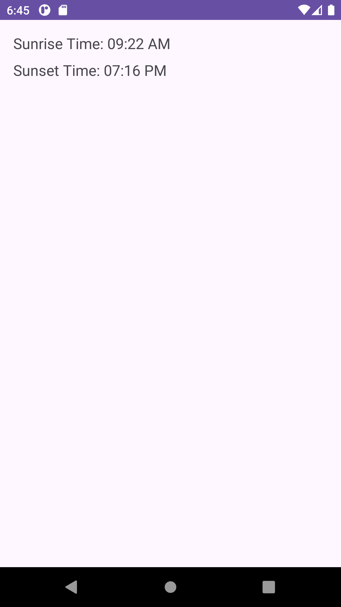
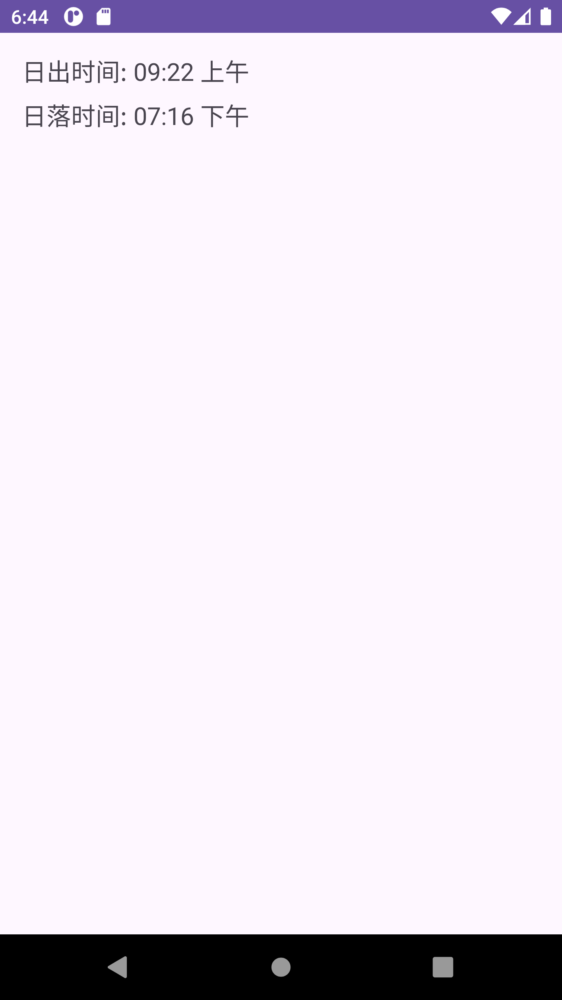
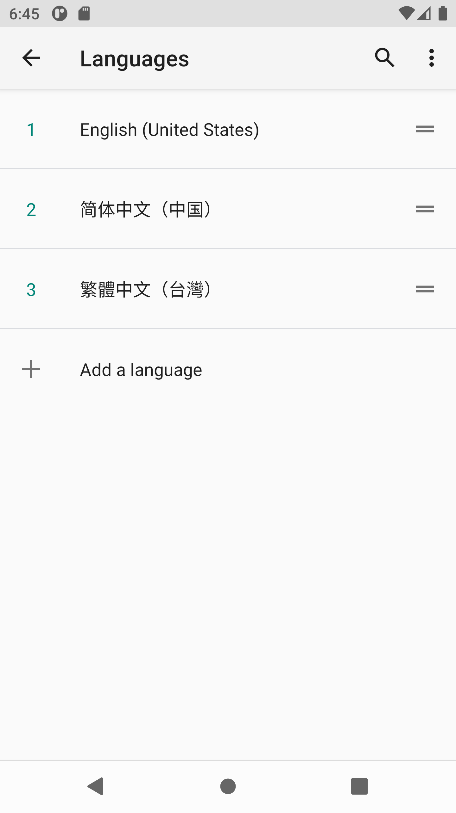

# Sunrise-Set-MDP

## App Screens

### English

### Chinese

### Language settings

## Installation
- Clone the repository.
- Open the project in Android Studio.
- Build and run the app on an Android device or emulator.

